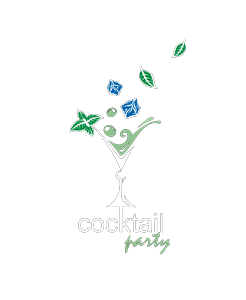

# 🍸 Cocktail Party

Une application web moderne dédiée à l'art de la mixologie, construite avec React. Découvrez, apprenez et maîtrisez l'art du cocktail avec notre collection complète de recettes, conseils et techniques professionnelles.



## ✨ Fonctionnalités

- **🔍 Recherche Avancée** : Trouvez des cocktails par nom ou ingrédient
- **📚 Collection Complète** : Plus de 1000 recettes de cocktails classiques et modernes
- **🎯 Guides Pratiques** : Conseils professionnels pour perfectionner votre technique
- **🥃 Matériel Professionnel** : Guide complet des outils essentiels du barman
- **🍷 Types de Verres** : Découvrez quel verre utiliser pour chaque cocktail
- **📱 Design Responsive** : Interface moderne et adaptée à tous les écrans
- **🎨 Animations Fluides** : Expérience utilisateur immersive avec Framer Motion

## 🚀 Démonstration

Visitez l'application en ligne : [https://geoffont.github.io/cocktailparty](https://geoffont.github.io/cocktailparty)

## 🛠️ Technologies Utilisées

### Frontend
- **React 18** - Framework JavaScript moderne
- **React Router v6** - Navigation et routage
- **Framer Motion** - Animations et transitions fluides
- **Lucide React** - Icônes modernes et élégantes
- **CSS3** - Styling avec Glass Morphism et effets modernes

### API & Données
- **Axios** - Requêtes HTTP
- **TanStack Query** - Gestion d'état et cache
- **TheCocktailDB API** - Base de données de cocktails

### Développement
- **React Scripts** - Configuration et build
- **GitHub Pages** - Déploiement automatique
- **ESLint** - Qualité du code

## 📦 Installation

### Prérequis
- Node.js (version 14 ou supérieure)
- npm ou yarn

### Étapes d'installation

1. **Clonez le repository**
   ```bash
   git clone https://github.com/geoffont/cocktailparty.git
   cd cocktailparty
   ```

2. **Installez les dépendances**
   ```bash
   npm install
   ```

3. **Lancez l'application en mode développement**
   ```bash
   npm start
   ```

4. **Ouvrez votre navigateur**
   ```
   http://localhost:3000
   ```

## 🏗️ Structure du Projet

```
cocktailparty/
├── public/
│   ├── index.html
│   ├── manifest.json
│   └── glassIcone.ico
├── src/
│   ├── components/
│   │   ├── CocktailCard/      # Carte d'affichage des cocktails
│   │   ├── CocktailList/      # Liste des cocktails
│   │   ├── footer/            # Pied de page
│   │   ├── header/            # En-tête et navigation
│   │   ├── search/            # Barre de recherche
│   │   └── ui/                # Composants UI réutilisables
│   ├── routes/
│   │   ├── Barman.js         # Page du barman
│   │   ├── Conseils.js       # Conseils de mixologie
│   │   ├── Materiel.js       # Guide du matériel
│   │   └── Verre.js          # Types de verres
│   ├── images/
│   │   ├── background/       # Images de fond
│   │   ├── conseils-img/     # Images pour les conseils
│   │   ├── logos/            # Logos et icônes
│   │   ├── materiel-img/     # Images du matériel
│   │   └── verres-img/       # Images des verres
│   ├── App.js               # Composant principal
│   ├── App.css              # Styles principaux
│   ├── index.js             # Point d'entrée
│   └── index.css            # Styles globaux
├── package.json
└── README.md
```

## 🎨 Design & Expérience Utilisateur

### Palette de Couleurs
- **Thème Principal** : Deep Ocean & Gradient
- **Effets** : Glass Morphism avec transparence
- **Animations** : Transitions fluides et micro-interactions

### Responsive Design
- 📱 Mobile First
- 💻 Desktop Optimized
- 🖥️ Large Screens Support

## 🔧 Scripts Disponibles

```bash
# Démarrer en mode développement
npm start

# Construire pour la production
npm run build

# Lancer les tests
npm test

# Déployer sur GitHub Pages
npm run deploy

# Éjecter la configuration (irréversible)
npm run eject
```

## 📋 Pages & Fonctionnalités

### 🏠 Page d'Accueil
- Hero section avec présentation
- Barre de recherche interactive
- Mise en avant des fonctionnalités

### 🍹 Recherche de Cocktails
- Recherche par nom ou ingrédient
- Affichage des résultats en cartes
- Détails complets de chaque cocktail

### 👨‍🍳 Conseils de Barman
- 10 règles d'or de la mixologie
- Techniques professionnelles
- Conseils pratiques

### 🔨 Matériel Professionnel
- Outils essentiels vs optionnels
- Descriptions détaillées
- Recommandations d'achat

### 🥃 Guide des Verres
- Verres essentiels et spécialisés
- Associations cocktail-verre
- Guide visuel complet

## 🌐 API Integration

L'application utilise [TheCocktailDB API](https://www.thecocktaildb.com/api.php) pour :
- Recherche de cocktails
- Détails des recettes
- Images des cocktails
- Informations sur les ingrédients

## 🚀 Déploiement

### GitHub Pages (Automatique)
```bash
npm run deploy
```

### Build Manual
```bash
npm run build
```
Les fichiers de production se trouvent dans le dossier `build/`.

## 🤝 Contribution

Les contributions sont les bienvenues ! Pour contribuer :

1. Forkez le projet
2. Créez une branche pour votre fonctionnalité (`git checkout -b feature/AmazingFeature`)
3. Committez vos changements (`git commit -m 'Add some AmazingFeature'`)
4. Pushez vers la branche (`git push origin feature/AmazingFeature`)
5. Ouvrez une Pull Request

## 📄 Licence

Ce projet est sous licence MIT. Voir le fichier `LICENSE` pour plus de détails.

## 👨‍💻 Auteur

**Geoffroy Fontaine**
- GitHub: [@geoffont](https://github.com/geoffont)
- Projet: [Cocktail Party](https://github.com/geoffont/cocktailparty)

## 🙏 Remerciements

- [TheCocktailDB](https://www.thecocktaildb.com/) pour l'API gratuite
- [Lucide Icons](https://lucide.dev/) pour les icônes élégantes
- [Framer Motion](https://www.framer.com/motion/) pour les animations
- La communauté React pour les outils et ressources

## 📈 Roadmap

- [ ] Système de favoris
- [ ] Mode sombre/clair
- [ ] Recommandations personnalisées
- [ ] Partage sur réseaux sociaux
- [ ] Version mobile native
- [ ] API de cocktails personnalisée

---

⭐ N'hésitez pas à mettre une étoile si ce projet vous plaît !